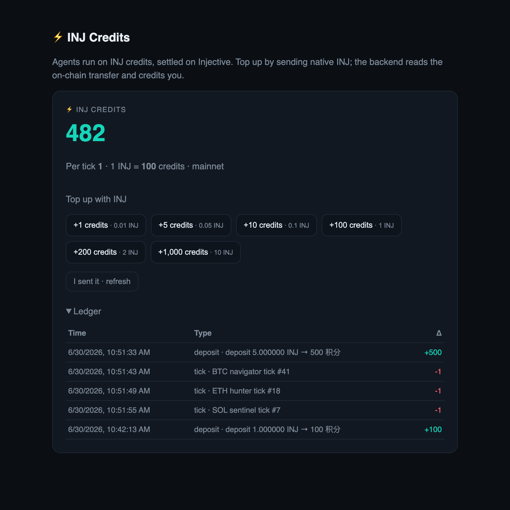

<div align="center">

# 🐱⚡ Maneki Inj — INJ 积分与结算层

### 为自治 AI Agent **供能**的 Injective 结算层 —— 用原生 INJ「按决策付费」。

[](https://injectivenova.com/)
[](http://www.manekiai-inj.com/)
[](https://github.com/InjectiveLabs/injective-py)

[English](./README.md) · **简体中文**

</div>

> ### ⚠️ 本仓库范围
> 本仓库**只开源 Maneki Inj 的 Injective 积分 / 结算层**——即把链上 INJ 变成 agent 燃料并计量的那部分。
> **核心的多 agent 交易引擎（策略、LLM 决策、下单执行、风控）为闭源，不在本仓库。** 这里的代码自洽、可运行，且**不含任何私钥或个人隐私数据**。

---

## 这是什么

**Maneki Inj** 是一个由一支自治 AI Agent 舰队替你交易的平台。这些 agent 不是免费运行的——**它们用原生 INJ 为自己的运行付费，在 Injective 上结算。** 本仓库就是这一层：

> **在 Injective 上充 INJ → 变成 agent 燃料（积分）→ agent 每做一个决策烧一点积分 → 积分耗尽，agent 停。**

它是一套自洽的「**按决策付费（pay-per-decision）**」支付轨道：机器发起、链上结算、按付款方精确归属、幂等、演示安全。任何 Injective 上的 AI-agent 产品都能复用它来对 agent 运行计费。

```
server/inj_chain.py            Injective SDK 链上原语——构建 MsgSend / 广播 / indexer 扫描
server/deposits.py             scan_for_user——给某钱包【自己的】INJ 转账入账（txhash 去重）
server/points_model.py         INJ 积分账本——balance / credit / debit / try_debit / seen_txhash
server/points_config.py        运营方配置——treasury / 汇率 / 每 tick / 预设档（env 驱动）
server/points_routes.py        FastAPI 接口——/api/points、/deposit/build|submit、/scan
server/credits_engine_hook.py  （闭源）agent 循环如何【消耗】积分（起跑预检 + 每 tick）
server/admin_points.py         运营方视图——每钱包余额 / 已消耗 / 已充 INJ
server/db.py                   最小 SQLite——points_ledger / points_tx / deposit_senders
server/app.py                  可运行 demo（uvicorn server.app:app）
web/                           一键充值面板（预设档 → Keplr/Leap/OKX signDirect）
```

### 📸 界面预览 — 积分面板

<div align="center">

<br/><sub>一键 INJ 充值档 · 实时积分余额 · 链上结算流水（充值入账 + 每次决策扣费）。</sub>
</div>

---

## 🏆 Injective Nova — Agent 基础设施 × AI 智能支付

为 **[Injective Nova](https://injectivenova.com/)** 计划打造（由 **Injective × Microsoft × Web3Labs** 联合发起）。这一层正好直接对应 Nova 的两个方向：**Agent Infrastructure**（让一支 agent 舰队得以存在的运行经济）与 **AI Smart Payments**（agent 进行真实的链上经济行为）。

📎 [Nova 官网](https://injectivenova.com/) · [提交要求与评估标准（中文）](https://injective.com/zh/blog/injective-nova-program-cn) · [Injective 文档](https://docs.injective.network) · [AI 开发者文档](https://docs.injective.network/developers-ai/index) · [Injective Agent SDK](https://github.com/InjectiveLabs/injective-agent-sdk) · [Injective Agents 介绍](https://injective.com/blog/injective-agents-the-platform-for-autonomous-ai-trading-agents) · [Build on Injective](https://injective.com/build)

---

# 第一部分 — 产品

## 1. 问题：自治 agent 需要一套经济"生命维持系统"

一个 7×24 运行的 AI agent 并非零成本——它消耗模型推理、数据与在线时长。要让 agent 真正"自治"而不是"被人盯着"，它需要一种方式**为自己的存在付费**，且这个计量是透明、无需信任、钱花完就停的。今天这个计量通常是一份隐藏的 SaaS 订阅。我们把它搬到**链上、用 INJ 计价**。

## 2. 模型：按决策付费（pay-per-decision）

agent 生命的原子单位是一次**决策 tick**——一轮「采集 → 推理 → 行动」。Maneki Inj 给这个单位定价：

| 概念 | 含义 |
| --- | --- |
| **积分（Credit）** | agent 运行的单位。`1 INJ = INJ_POINTS_PER_INJ` 积分（默认 100）。 |
| **燃烧速率** | 每个决策 tick 花 `INJ_POINTS_PER_TICK` 积分（默认 1）。 |
| **燃料耗尽** | 当钱包付不起下一 tick，它的 agent **自动停**。没有静默透支。 |
| **关注点分离** | 积分计量的是**思考权**，与**交易保证金/盈亏完全独立**——策略资金在别处，INJ 只买"认知 + 在线"。 |

为什么要把"思考成本"和"交易资金"解耦？因为它们是两种不同的风险、不同的归属方：*平台*提供智能与在线（用 INJ 积分付费），*用户*提供交易资金（自己的钱）。把二者混在一起，正是大多数"交易机器人"不透明的根源。按决策付费让"自治的成本"变得显式、且在链上。

## 3. 用户流程

1. **连接钱包**，进入 agent 面板。
2. **充值**——选一个预设档（`+1 / +5 / +10 / +100 / +200 / +1000 积分`）。应用折算成 INJ 并拉起钱包（Keplr / Leap / OKX）签一笔到 treasury 的转账。
3. **自动入账**——后端经 Injective indexer 看到你的链上转账，按发送方归属、按 txhash 去重，把积分记到*你的*账户。
4. **跑 agent**——agent 一边思考一边烧积分；实时仪表显示余额递减；积分不够时 `402` 拦住启动。
5. **运营方视图**——后台能看到每个用户的余额、已消耗积分（消耗的运行时长）、已充 INJ。

## 4. 为什么这是个好产品

- **无需信任的计量。** 积分*只*来自经 indexer 核验的、来自你自己钱包的转账——刷新不会造分，并发充值者各记各的。平台甚至从不读 treasury 余额。
- **非托管。** 平台负责构建与广播，但**由你的钱包签名**。任何充值私钥都不上服务器（只存 treasury *地址*）。
- **经济对齐。** 运营方对 agent 的*运行时长*（真实成本）收费，而不是托管用户的交易资金。一个干净、可复用的 Injective 变现范式。
- **对用户友好。** 一键充值、预设档、实时燃料表、透明账本。

---

# 第二部分 — 技术

## 5. 如何接入 Injective

所有链上访问集中在 **`server/inj_chain.py`**，经官方 **`injective-py`** SDK，跑在一条专用后台事件循环上，供其余代码以同步函数调用。全程原生 INJ 的 denom 为 **`inj`**、**18 位精度**。

### 5.1 网络客户端

```python
from pyinjective.core.network   import Network          # 端点（gRPC indexer、chain LCD/RPC）
from pyinjective.async_client_v2 import AsyncClient      # 链读写（composer、gas、广播）
from pyinjective.indexer_client  import IndexerClient    # indexer 读（账户交易历史）

net = Network.mainnet() if network == "mainnet" else Network.testnet()
clients = (net, IndexerClient(net), AsyncClient(net))    # 按网络缓存
```

### 5.2 充值 = 用户在浏览器里自己签名的非托管 INJ 转账

**(a) 构建**（服务端，`POST /api/points/deposit/build`）：
```python
addr = Address.from_acc_bech32(sender_inj)
await addr.async_init_num_seq(net.lcd_endpoint)            # 从链上取账号 + 序列号
msg = composer.msg_send(from_address=sender_inj, to_address=treasury,
                        amount=int(Decimal(amount) * 10**18), denom="inj")
gas_price = int(await ac.current_chain_gas_price() * 1.2)  # 实时 gas
tx  = Transaction().with_messages(msg).with_sequence(seq).with_account_num(num) \
                   .with_chain_id(net.chain_id).with_gas(120000).with_fee(...)
sign_doc = tx.get_sign_doc(pubkey)                          # → bodyBytes / authInfoBytes (base64)
```

**(b) 签名**（浏览器钱包，Keplr / Leap / OKX 共用 Keplr API）：
```js
await wallet.enable(chainId);                               // injective-1（主网）/ injective-888（测试网）
const k = await wallet.getKey(chainId);
const signed = await wallet.signDirect(chainId, k.bech32Address,
                                       { bodyBytes, authInfoBytes, chainId, accountNumber });
```

**(c) 广播**（服务端，`POST /api/points/deposit/submit`）：
```python
tx_raw = cosmos_tx.TxRaw(body_bytes=…, auth_info_bytes=…, signatures=[…])
res = await ac.broadcast_tx_sync_mode(tx_raw.SerializeToString())   # 返回 txhash
```

### 5.3 结算 = 读链上、给付款方入账（精确、幂等）

我们**从不读 treasury 余额**，而是经 Injective indexer 读它的**入账转账历史**、给*发送方*入账（`server/deposits.py`）：

```python
r = await ic.fetch_account_txs(address=treasury, pagination=PaginationOption(limit=40))
for t in r["data"]:
    for m in json.loads(base64.b64decode(t["messages"])):           # messages 是 base64(JSON)
        if m["type"] == "/cosmos.bank.v1beta1.MsgSend" and m["value"]["to_address"] == treasury:
            sender     = m["value"]["from_address"]
            amt_inj    = Decimal(coin["amount"]) / 10**18            # denom == "inj"
            sender_eth = "0x" + Address.from_acc_bech32(sender).to_hex()   # bech32 → 0x（登录身份）
            # 给匹配的登录钱包入账，按 t["hash"] 幂等
```

- **按发送方归属** → 多租户、并发安全。
- **按链上 txhash 幂等** → 刷新永远不会重复造分。
- **从不读余额** → 只有当存在一条来自*你的*地址的真实转账记录时才算充值成功。

`scan_for_user(address)` 只给"发送方映射到请求者钱包"的转账入账——所以一个用户的"刷新"永远拿不到别人的充值。

### 5.4 消耗侧（认知的结算）

闭源引擎与本层只有两个接触点（`server/credits_engine_hook.py`）：

```python
def can_start(address):       # 起跑预检 → API 把 False 变成 HTTP 402
    return points_model.balance(address) >= points_config.points_per_tick()

def charge_one_tick(address): # 每个决策 tick 调一次；False → 没燃料，停 agent
    return points_model.try_debit(address, points_config.points_per_tick(), kind="tick")
```

`try_debit` 是原子的（余额行与账本行在同一把锁下一起移动），且永不为负。

### 5.5 数据模型（`server/db.py`）

| 表 | 用途 |
| --- | --- |
| `points_ledger` | 每钱包积分 `balance` |
| `points_tx` | 追加式流水；充值带 `txhash`（幂等）+ `token_amount`（INJ） |
| `deposit_senders` | 把充值的 inj/0x 地址 → 应入账的登录钱包 |

## 6. API 速查

| 方法 | 路径 | 说明 |
| --- | --- | --- |
| `GET` | `/api/points` | 余额 + 配置（treasury / 汇率 / 每 tick / 预设档）+ 流水 |
| `POST` | `/api/points/deposit/build` | 构建一笔未签名的 INJ `MsgSend` 供钱包 `signDirect` |
| `POST` | `/api/points/deposit/submit` | 广播钱包签名的 tx，然后扫描入账 |
| `POST` | `/api/points/scan` | 给*该用户*尚未入账的到 treasury 的 INJ 转账入账 |

> 完整应用里登录 `address` 来自钱包签名会话；本独立 demo 从 `X-Login-Address` 头读取——换成你自己的鉴权依赖即可。

## 7. 跑起 demo

```bash
python3.12 -m venv .venv && . .venv/bin/activate     # injective-py 需要 Python 3.12（coincurve 轮子）
pip install -r requirements.txt
export INJ_TREASURY_ADDRESS=inj1youroperatoraddress  # 用户充值的收款地址
export INJ_TREASURY_NETWORK=mainnet INJ_POINTS_PER_INJ=100 INJ_POINTS_PER_TICK=1
uvicorn server.app:app --port 8000
# 打开 http://127.0.0.1:8000/  → 填你的钱包地址 → 充值 → 看积分到账
```

运营方配置项见 `data.example/inj_deposit.env.example`。

## 8. 隐私与安全

- **本仓库无任何私钥、无 PII。** 服务器只需 treasury **地址**即可收款/扫描，从不需要充值私钥。唯一的"个人数据"是一个公开钱包地址。
- **非托管充值**（钱包签名）+ **只读结算**（indexer）。
- `data/`（SQLite 账本）与任何 `.env` 均被 gitignore。

---

## 作者

由 **Hayden** 为 [Injective Nova](https://injectivenova.com/) 计划打造。

<div align="center"><sub><b>Maneki Inj</b> — 给 AI 一个装着 INJ 的钱包，它会一直交易到燃料耗尽。⚡</sub></div>
