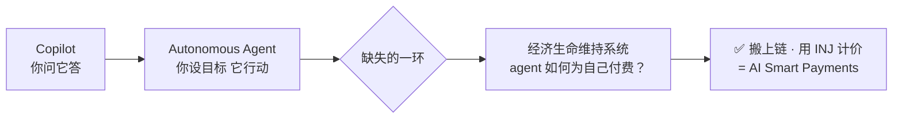
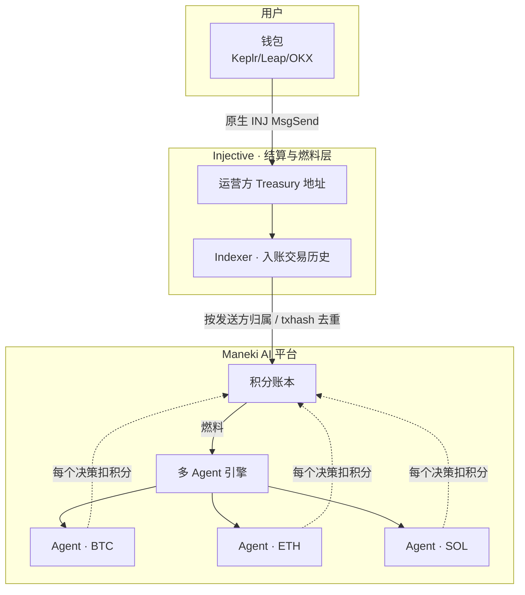
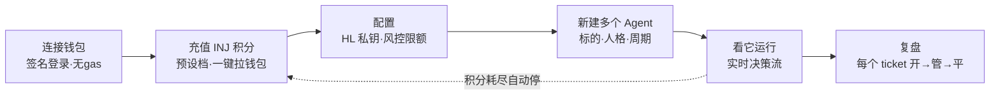
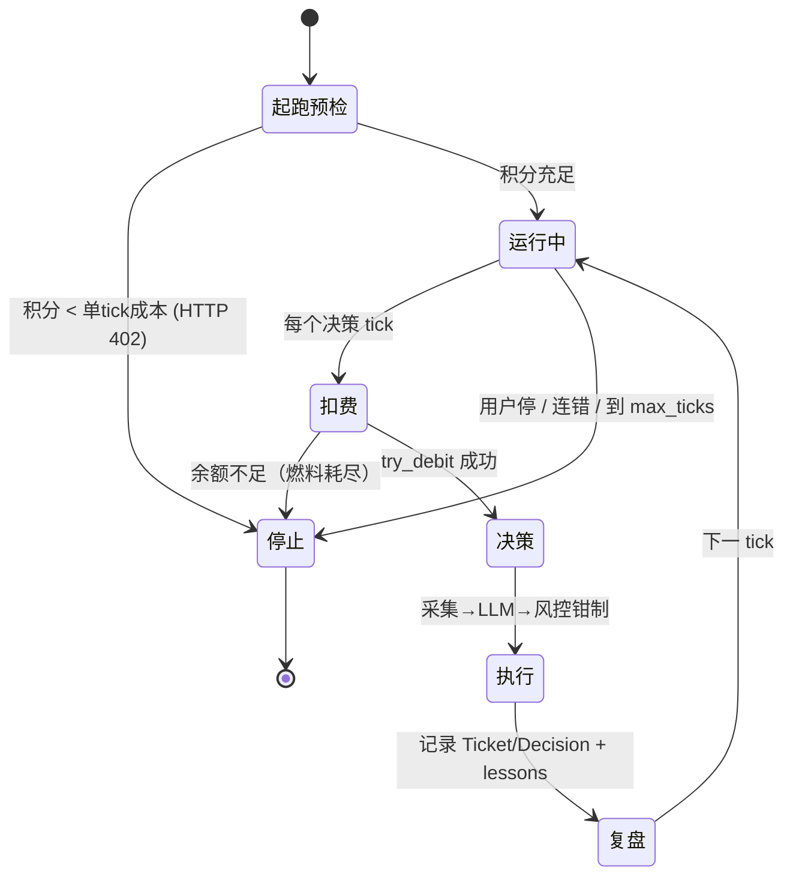
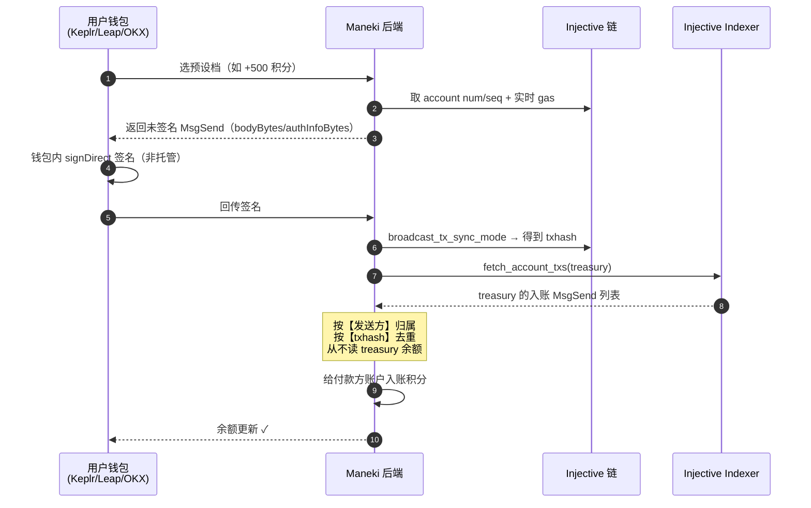
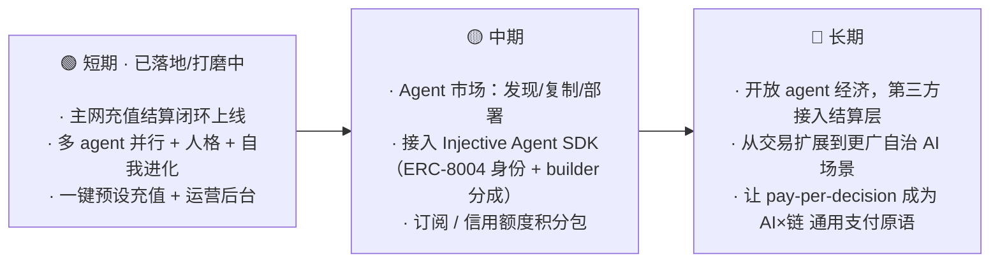

# Maneki Inj · 产品说明文档（Product Documentation）

> **Maneki AI 多 Agent 自治交易平台 —— 搭载 Injective 作为结算层。**
> 给一支 AI Agent 舰队一个装着 INJ 的钱包，它们替你盯盘、推理、交易，并用原生 **INJ 为自己的每一个决策付费**，直到燃料耗尽。

🌐 在线：http://www.manekiai-inj.com/ ｜ 🏆 [Injective Nova](https://injectivenova.com/)（由 Injective × Microsoft × Web3Labs 联合发起）

> 📦 **开源范围：** 本文档面向**整个产品**；其中的 **Injective 充值/结算层已开源**（本仓库），而**核心多 Agent 交易引擎为闭源**。

---

## 目录

1. [背景与机会](#1-背景与机会)
2. [产品概述：三个角色，一条闭环](#2-产品概述三个角色一条闭环)
3. [多 Agent 平台如何运作](#3-多-agent-平台如何运作)
4. [与 Injective 的结合（核心）](#4-与-injective-的结合核心)
5. [产品设计深挖](#5-产品设计深挖)
6. [用了什么技术 · 什么能力 · 什么效果](#6-用了什么技术--什么能力--什么效果)
7. [安全与隐私](#7-安全与隐私)
8. [商业模式](#8-商业模式)
9. [未来前景与路线图](#9-未来前景与路线图)
10. [总结](#10-总结)

---

## 1. 背景与机会

AI 正在从「你问一句、它答一句」的 **Copilot**，走向「你设定目标、它自己持续行动」的 **Autonomous Agent**。在交易这个高频、24×7、强反馈的场景里，自治 agent 的价值尤其突出：人会累、会情绪化、会错过盘口，而 agent 不会。

但要让 agent **真正自治**（而不是被人盯着、随时手动续命），缺了关键一环——

> **Agent 的「经济生命维持系统」：它如何自治地为自己的运行付费？这个计量必须透明、无需信任、且钱花完就自动停。**

今天这件事通常被藏在一份看不见的 SaaS 订阅里。我们把它**搬到链上、用 INJ 计价**——这正是 Injective Nova 所说的 **AI Smart Payments**：让 AI 产生真实的、链上的经济行为。

---

## 2. 产品概述：三个角色，一条闭环

**Maneki Inj** 让一个钱包驱动一整支 AI Agent 舰队，每个 agent 盯一个标的、按你选的人格自治交易。整个系统由三个角色构成，形成一条清晰的闭环：

| 角色 | 提供什么 | 得到什么 |
| --- | --- | --- |
| **用户** | 交易资金（自己的钱）+ INJ 积分（agent 燃料） | 一支替自己 24×7 工作、可解释、可控的 agent 舰队 |
| **Agent（AI）** | 自治的认知与执行（盯盘 → 推理 → 下单 → 复盘） | 每个决策消耗 INJ 积分作为「运行权」 |
| **Injective** | 充值的结算与记账轨道（链上、indexer 可验证） | 成为自治 AI agent 经济体的**结算层** |

---

## 3. 多 Agent 平台如何运作

### 3.1 用户旅程

### 3.2 一个 Agent 的解剖

一个 agent = **一个标的 + 一种人格 + 自己的节奏与资金盒**。它不是一个静态脚本，而是一个有生命周期、会自我修正、会自我进化的经济行动者。

- **人格（persona）**：Sentinel（稳健）/ Navigator（平衡）/ Hunter（进取）/ Apex（极致）/ 自定义 prompt —— 每种是一套独立的决策哲学。
- **生命周期**：每个 agent 维护一个 **Ticket**（开仓 → 管理 → 平仓的完整周期），每个 tick 产出一条 **Decision**（中英双语理由、置信度、市场观察）——全部落库可回放。
- **自我进化**：agent 从自己平掉的交易里提炼 **lessons**，回灌进下一轮 prompt；周期性 + 停止时生成复盘报告。
- **自我修正**：把真实执行反馈（拒单、风控钳制、成交）回放进下一 tick，让它自适应。

### 3.3 为什么是「系统」而非「脚本」

| 能力 | 说明 |
| --- | --- |
| **舰队，而非单 bot** | 引擎按 `agent_id`（而非钱包）隔离会话 → 一个钱包可并行无数个 agent，各自一条独立 async 循环。 |
| **多租户隔离** | 钱包签名登录；每份密钥/配置/交易/报告按钱包命名空间隔离；签名私钥 Fernet 加密存储。 |
| **代码强制风控** | 杠杆 `min(模型, 用户, 标的)`、单笔名义封顶、kill-switch、连错自动停、max-ticks、**燃料耗尽自动停**。 |
| **稳定性** | 全舰队 LLM 并发上限；进程重启后自动恢复仍在运行的 agent。 |

---

## 4. 与 Injective 的结合（核心）

### 4.1 为什么选 Injective 作结算层

- **完全链上、可验证**：撮合/转账/结算透明，indexer 提供精确的交易历史，天生适合做「按决策付费」的计量与对账。
- **原生 INJ + 银行模块**：用一条标准 `cosmos.bank.MsgSend` 就能完成充值，钱包（Keplr/Leap/OKX）原生支持签名，非托管。
- **AI 原生生态**：Injective 把自己定位为「自治 AI 交易 agent 的平台」，并提供 [Injective Agent SDK](https://github.com/InjectiveLabs/injective-agent-sdk)（ERC-8004 链上身份、builder code 手续费分成）——给本产品的长期演进留足了空间。

### 4.2 产品层面的结合：把「思考」变成可结算的链上行为

我们把 agent 生命的原子单位——**一次决策 tick（采集 → 推理 → 行动）**——定价并结算在 Injective 上：

> **充 INJ → 变成积分（agent 燃料）→ 每个决策烧 1 积分 → 积分归零，agent 自动停。**

### 4.3 界面预览

 一键 INJ 充值档 · 实时积分余额 · 链上结算流水（充值入账 + 每次决策扣费 BTC/ETH/SOL agent）。

---

## 5. 产品设计深挖

### 5.1 核心设计原则

| 原则 | 含义与价值 |
| --- | --- |
| **关注点分离** | 积分计量的是**思考权 / 运行权**，与**交易保证金/盈亏完全独立**。平台提供智能与在线（用 INJ 计费），用户提供交易资金（自己的钱）。这正是大多数「交易 bot」不透明的根源——我们把两者拆开。 |
| **无需信任的计量** | 积分**只**来自 indexer 核验的、来自你自己钱包的真实转账，按 txhash 去重 → 刷新不会造分、并发充值各记各的。 |
| **非托管** | 平台负责构建与广播，**用户钱包签名**；任何充值私钥都不上服务器（只存 treasury 地址）。 |
| **人性化** | 一键充值、预设档、实时燃料表、透明账本、中英双语理由 —— Human-friendly AI。 |

### 5.2 积分经济模型

| 参数 | 默认 | 说明 |
| --- | --- | --- |
| 兑换比例 `INJ_POINTS_PER_INJ` | 100 | 1 INJ = 100 积分 |
| 燃烧速率 `INJ_POINTS_PER_TICK` | 1 | 每个决策 tick 烧 1 积分 |
| 预设充值档 `MANEKI_POINTS_PRESETS` | 1/5/10/100/200/1000 | 一键档位（积分） |
| 起跑闸 | — | 余额 < 单 tick 成本 → 启动 agent 返回 **HTTP 402** |
| 燃料耗尽 | — | 余额付不起下一 tick → 该 agent **自动停**，无静默透支 |

### 5.3 运营方视角

后台（`admin_points.py`）按钱包聚合：**余额 · 已消耗积分（= agent 消耗的运行时长）· 已充 INJ**，让运营方一眼看清平台的「运行经济」。唯一的个人数据就是公开钱包地址——无密钥、无 PII。

### 5.4 为什么读「入账交易」而不是「余额」

这是本设计最关键的正确性保证：**如果读 treasury 余额、按增量加分**，那么任何人每次刷新都能把余额一次性领走、并发充值会互相串、运营方自己的资金也会被误记。**改为读 indexer 的入账 `MsgSend` 记录、按发送方精确归属、按 txhash 幂等去重**，才做到了精确、并发安全、且演示安全。

---

## 6. 用了什么技术 · 什么能力 · 什么效果

| 用到的 Injective 能力 | 通过什么 | 起到的效果 |
| --- | --- | --- |
| 网络与端点 | `pyinjective` `Network.mainnet()/testnet()` | 同一套代码主网/测试网通用 |
| 构建充值交易 | `composer.msg_send(denom="inj")` + `Transaction.get_sign_doc` | 服务端构建、用户钱包 `signDirect` 签名（非托管） |
| 取账号/序列号/gas | `Address.async_init_num_seq` + `current_chain_gas_price` | 交易可被链接受、gas 实时合理 |
| 广播签名交易 | `AsyncClient.broadcast_tx_sync_mode(TxRaw)` | 拿到 txhash、完成上链 |
| 读入账交易历史 | `IndexerClient.fetch_account_txs(treasury)` | 精确拿到「谁付的、付了多少、哪笔 tx」 |
| 地址身份映射 | `Address.from_acc_bech32(sender).to_hex()` | 把链上 inj 地址映射回登录身份，精确归属 |

**技术栈**：FastAPI · Uvicorn · **injective-py**（indexer + chain）· eth-account（钱包验签）· cryptography（Fernet）· OpenRouter（LLM）· 原生 ES-module 前端（无构建）。

---

## 7. 安全与隐私

- **服务器无任何充值私钥**：收款/扫描只需 treasury **地址**。
- **非托管充值**（钱包签名）+ **只读结算**（indexer）。
- 用户的永续签名私钥经 **Fernet 加密**存储（主密钥从密管注入），永不回显、永不进日志。
- 整个 `data/`（SQLite 账本、密钥密文）被 `.gitignore`；公开仓库里**零密钥、零 PII**。

---

## 8. 商业模式

- **对 agent「运行时长」计费**（真实成本），而**不托管用户的交易资金** —— 经济激励干净、对齐。
- **单位经济透明**：每个决策的成本以 INJ 计价、链上可查；运营方的收入 = 平台 agent 的 INJ 流入。
- **可复用的范式**：这套「链上 INJ → agent 燃料」的结算层是通用的，任何 Injective 上的 AI-agent 产品都能直接复用来对自家 agent 的运行变现 —— 这本身就是一个面向 Injective 生态的基础设施机会。

---

## 9. 未来前景与路线图

- **短期**：把主网充值结算闭环打磨到稳定（已上线 www.manekiai-inj.com），扩充标的与策略模板，完善运营后台。
- **中期**：上线 **Agent 市场**（一个开放的 agent 发现/复制/部署生态）；接入 **Injective Agent SDK** 注册 ERC-8004 链上身份、带 builder code 领取手续费分成；推出订阅式/信用额度的积分包，降低门槛。
- **长期**：把这套结算层**开放给第三方 agent**接入 —— 让任何自治 AI agent 都能在 Injective 上「为自己付费、自治运行」；并把场景从交易扩展到更广的自治 AI 应用，让 **「按决策付费（pay-per-decision）」成为 AI × 链的通用支付原语**。

---

## 10. 总结

**Maneki AI 负责智能（一支自我进化的多 agent 舰队），Injective 负责结算（为每个 agent 的每一个决策供资、计量、记账）。**

我们没有把 Injective 当成一个「可有可无的下单通道」，而是把它做成了一个**自治 AI agent 经济体的结算层**——这是一个真实、可验证、可复用的链上 AI 支付原语，也是本项目对 Injective 生态的核心贡献。

> **给 AI 一个装着 INJ 的钱包，它会一直交易到燃料耗尽。⚡**

---

Built by <b>Hayden</b> · for the <a href="https://injectivenova.com/">Injective Nova</a> program

